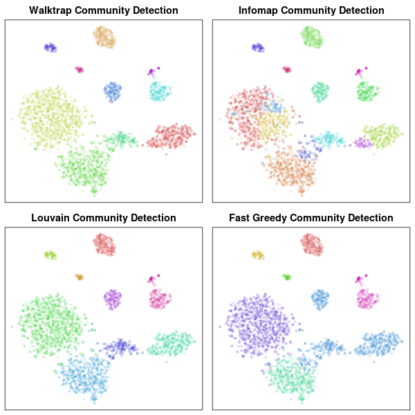

# MUDAN

### *Multi-sample Unified Discriminant ANalysis*

(Fun fact: [mudan (牡丹) means peony in Chinese](https://en.wikipedia.org/wiki/Paeonia_suffruticosa))

## MUDAN Benefits and Capabilities

### Enhanced visualizations
- Detected clusters are artificially separated for visualization purposes only

### Fast subpopulation detection and characterization
- Graph-based community detection for subpopulations
- Differential gene expression and marker selection functionalities

### Multi-sample clustering
- Preserves variation observed in each sample
- Ideal for when samples may differ in cell type composition

