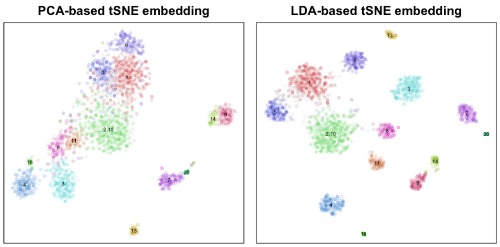
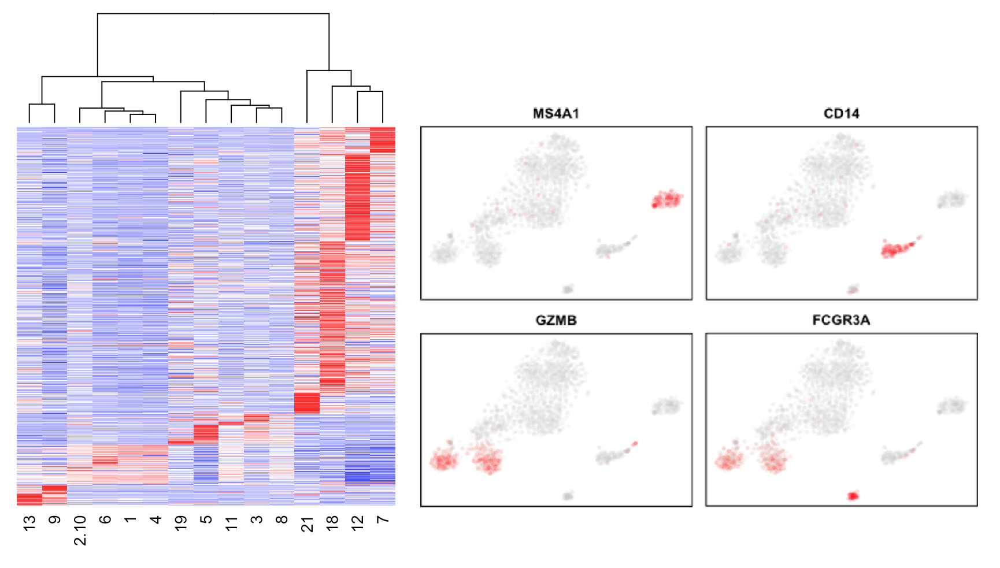
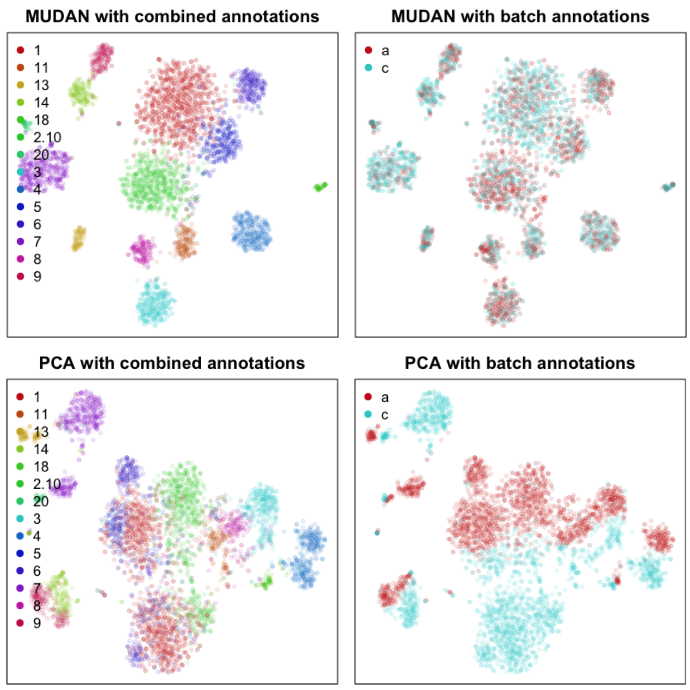

# MUDAN


### *Multi-sample Unified Discriminant ANalysis*

[](https://travis-ci.org/JEFworks/MUDAN)

(Fun fact: [mudan 牡丹 means peony in Chinese](https://en.wikipedia.org/wiki/Paeonia_suffruticosa))


Please note that `MUDAN` is still in active development and will likely see substantial changes in terms of its algorithms, data structure, and otherwise general functionalities in ways that may not be backwards compatible. 

---

## Motivation

To analyze multiple single-cell RNA-seq samples in a coherent manner in order to acheive joint annotation of cell types across patients, time-points, and batches. 

---

## Benefits and Capabilities

### Enhanced visualizations
- Detected clusters are artificially separated for visualization purposes only



### Fast subpopulation detection and characterization
- Graph-based community detection to identify subpopulations
- Stability analysis to ensure transcriptionally distinct subpopulations
- Differential gene expression and marker selection functionalities




### Multi-sample clustering
- Preserves variation observed in each sample
- Ideal for when samples may differ in cell type composition



### Please see [the vignettes](https://github.com/JEFworks/MUDAN/tree/master/vignette) for more information

---

## Install

```
require(devtools)
devtools::install_github("JEFworks/MUDAN")
```

---

## Contributing 

I welcome any bug reports, enhancement requests, and other contributions. To submit a bug report or enhancement request, please use the [`MUDAN` GitHub issues tracker](https://github.com/JEFworks/MUDAN/issues). For more substantial contributions, please fork this repo, push your changes to your fork, and submit a pull request with a good commit message.

