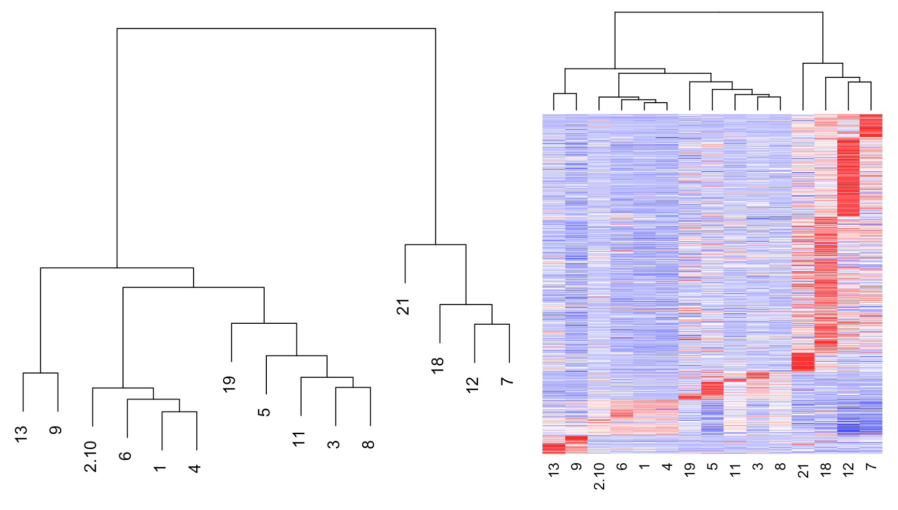

# MUDAN


### *Multi-sample Unified Discriminant ANalysis*

(Fun fact: [mudan 牡丹 means peony in Chinese](https://en.wikipedia.org/wiki/Paeonia_suffruticosa))

---

## Motivation

To analyze multiple single-cell RNA-seq samples in a coherent manner in order to acheive joint annotation of cell types across patients, time-points, and batches. 

---

## Benefits and Capabilities

### Enhanced visualizations
- Detected clusters are artificially separated for visualization purposes only


### Fast subpopulation detection and characterization
- Graph-based community detection to identify subpopulations
- Stability analysis to ensure transcriptionally distinct subpopulations
- Differential gene expression and marker selection functionalities




### Multi-sample clustering
- Preserves variation observed in each sample
- Ideal for when samples may differ in cell type composition


---

## Install

```
require(devtools)
devtools::install_github("JEFworks/MUDAN")
```

---

## Tutorials

Coming soon!

